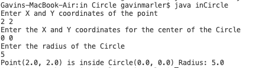

# helloWorld
## Overview
This program allows the User to input the center point and the radius of a circle, along with a seperate point, and will determine whether the point is within the circle or not. 
## Development Environment
* VS Code
* Java

## Execution
to compile this promgram put:
```java
javac inCircle.java
```
To run put: 
```java
java inCircle
``` 
Information should then be entered into the program.
The ouput is like this:  



## Useful Websites

*[Here](https://stackoverflow.com) is Stack Overflow that helped me with this project.
*[Here](https://www.java.com/en/) is the website for Java.